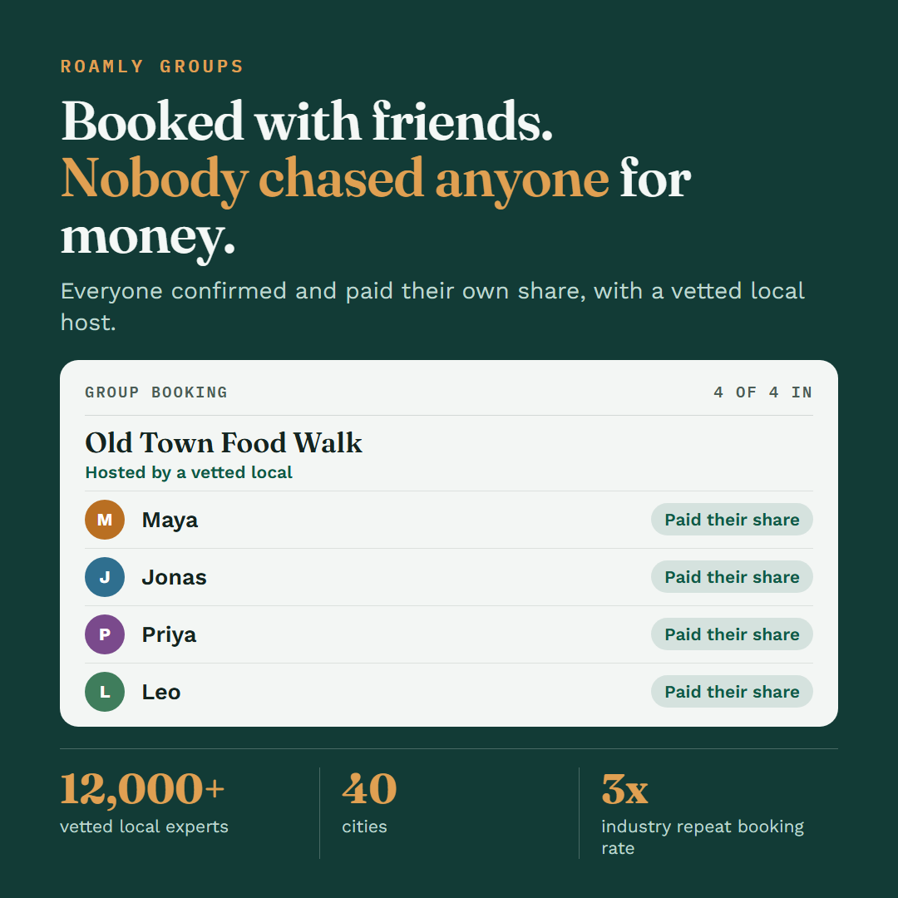

# Messaging Pillars & AI-Generated Asset — Roamly Groups

> Module 4 · Deliver Messaging That Captivates Customers — ★ Deliverable 4
>
> Turn your positioning into a message that moves people: set the market context, build a pillar per audience, activate it across surfaces, and produce one AI-generated asset.

## 1. Fro/To market shift

_What changed in the world that made Roamly Groups necessary? A shift in the world, not a feature._

| | |
|---|---|
| **From** (life before) | Group trips run on one person's goodwill. The organizer messages everyone, waits days for replies, puts their own card down, and then chases friends for money. Plans stall in the group chat, and half the ideas never get booked. |
| **To** (life after) | Deciding together and paying individually happen in the same moment. Everyone confirms their own spot and settles their own share, so no single person carries the group, and plans that get agreed on actually happen. |

## 2. Audience segmentation

- **Number of audiences that need their own pillar:** 2
  1. The organizer: the friend who plans the trip and starts the booking
  2. The invited group member: the friend who receives the invite and has to decide whether to join and pay
- **Justification:**
  - **Role or buying position:** The organizer initiates and carries the coordination burden. The invitee didn't choose the activity and is being asked to commit their money.
  - **Journey stage:** The organizer is often already a Roamly user. The invitee is often new to Roamly and hasn't yet decided to trust it.
  - **One message fails the test:** "Stop chasing people for money" moves the organizer, but it doesn't address what the invited member is deciding: what they're paying for and whether it's easy to say yes.
- **Considered and left out:** The host. The launch is aimed at travelers, hosts don't need to change behavior for a group to book, and a host pillar would need evidence that doesn't exist yet.

## 3. Messaging pillars

### Pillar — Audience 1: The organizer

| Layer | Message |
|---|---|
| **🎯 Value prop** | Be the one who makes the trip happen, without carrying the group. |
| **🏆 Capabilities** | Invite the whole group in one step. Keep one shared plan of the group's activities. Each person confirms and pays their own share automatically. |
| **📊 Evidence** | 12,000+ vetted local experts across 40 cities. Repeat booking rates 3x the industry average. |

### Pillar — Audience 2: The invited group member

| Layer | Message |
|---|---|
| **🎯 Value prop** | Say yes in seconds and pay only your own share, with your spot locked in. |
| **🏆 Capabilities** | Join straight from the invite. See the plan and your exact share before you confirm. Pay your share in the same step. |
| **📊 Evidence** | Every experience is hosted by a vetted local expert. Repeat booking rates 3x the industry average. |

_Evidence note: Roamly Groups is new, so this evidence comes from the existing platform, not from Groups itself._

## 4. Activation across surfaces

Copy was generated from the invited group member's pillar. Each line leads with a different layer.

| Surface | Copy variation | Leads with |
|---|---|---|
| Email subject line | Your spot is held. Confirm and pay just your share. | Value prop: earns the open by promising the outcome |
| In-app notification | Your group is one tap from booked. See your share, then confirm. | Capabilities: at the moment of use, the person needs to know what happens next |
| Social post | Booked with friends. Nobody chased anyone for money. Everyone confirmed and paid their own share, with a vetted local host. | Value, closing with evidence: a human outcome first, then the one proof point that fits a casual post |

## 5. AI-generated asset

- **Asset type:** Social post visual (1080 x 1080 PNG), built from the strongest variation, the social post.
- **Prompt used:** Copy was generated with the lab's generation prompt, pasting in the invited group member pillar and the three surfaces. The visual was then built from that reviewed copy with Claude, as a designed graphic (HTML and CSS) rendered to an image. No image model was used.
- **Output:** 
- **What you edited and why:** After the blind read, the card named the experience ("Old Town Food Walk, hosted by a vetted local") so a viewer can see what the group is booking and that this is travel. The friends' names and the experience are illustrative examples, not real data.

## 6. Blind-read result

An AI role-played a peer seeing the asset cold. These answers were taken on the first version of the image, before the fix above.

| Question | What they understood |
|---|---|
| Who is it built for? | People who plan things with friends and are tired of the money awkwardness. It seems aimed at whoever usually does the chasing. Unsure if it's for trips, nights out, or events. "Local host" and "40 cities" hint at travel. |
| What does the product do? | It lets a group book something together, and each person pays their own portion. Could not tell what is being booked: no activity, place or date on the card. |
| What makes you trust it? | The numbers: 12,000+ vetted local experts, 40 cities, 3x the industry repeat booking rate. Wanted to know what "vetted" means, and saw no customer quotes or real booking examples. |

**Signal and fix:** Audience partly sharp, product partly clear, evidence came through. The card now names the experience to fix the product and travel gaps. Still open: what "vetted" means, and proof from real group bookings once they exist.

## Link to full artifact

Raw exercise exports: [roamly-m4-messaging-ex1.md](roamly-m4-messaging-ex1.md) (pillars) and [roamly-m4-messaging-ex2.md](roamly-m4-messaging-ex2.md) (surfaces, asset and blind read)
